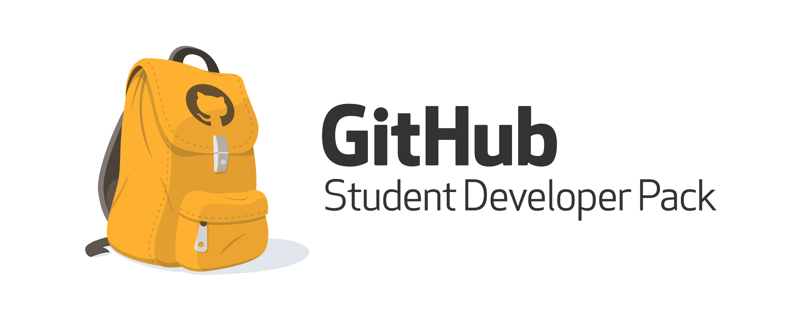

# GitHubStudentDeveloperPack
학생 개발자들을 위한 Copilot, 클라우드, 써드파티 유료 앱 등 무료 지원 서비스

개발에 열정적인 학생들이 많은데, 공부할때 도움되는 다양한 리소스들을 무료로 배울 수 있는 기회가 있습니다. 성장하는데 필요한  기초부터 실무까지 최고 수준의 개발자용 서비스를 제공합니다.

## 제공받는 서비스
코드를 대신 짜주는 `GitHub Copilot`, 웹 IDE `Codespaces`, 웹 기초, 클라우드, 온라인 해커톤 등이 대표적이고 아래에 토글을 열면 상세 서비스들을 볼 수 있습니다.  

[GitHub Student Developer Pack 바로가기](https://education.github.com/pack)

    
<b>제공받는 서비스 살펴보기</b>

        <ol>
            <li>GitHub Copilot: AI가 코딩 대신 해줘</li>
            
            <li>웹 기초 시작하기</li>
            
            <li>온라인 글로벌 해커톤 참가하기</li>
            
            <li>DevOps</li>
            
            <li>이외에도 많으니 [공홈](https://education.github.com/pack)을 참고하세요</li>
        </ol>

## 기본 자격
To qualify for student benefits, you must:
* GitHub 계정이 필요합니다.
* 최소 13살이여야 합니다.
* 대한민국 교육부 인정 교육 기관의 학생입니다.(대학교, 전문대학, 고등학교, 중학교)
* 현재 학교 재학을 증명하는 문서를 제공할 수 있습니다.(재학증명서)

## 진행 위해 필요한 것
* [카드 결제 등록](https://github.com/settings/billing/payment_information)
* [학교 이메일 등록](https://docs.github.com/en/account-and-profile/setting-up-and-managing-your-personal-account-on-github/managing-email-preferences/adding-an-email-address-to-your-github-account)
* [2단계 보안 인증](https://docs.github.com/en/authentication/securing-your-account-with-two-factor-authentication-2fa)
* [Profile 개인화](https://docs.github.com/en/account-and-profile/setting-up-and-managing-your-github-profile/customizing-your-profile/personalizing-your-profile)
* [관심분야 작성](https://docs.github.com/en/account-and-profile/setting-up-and-managing-your-github-profile/customizing-your-profile/managing-your-profile-readme)

## 어떻게 신청해요?
[지금 바로 신청하기](https://education.github.com/discount_requests/application)
